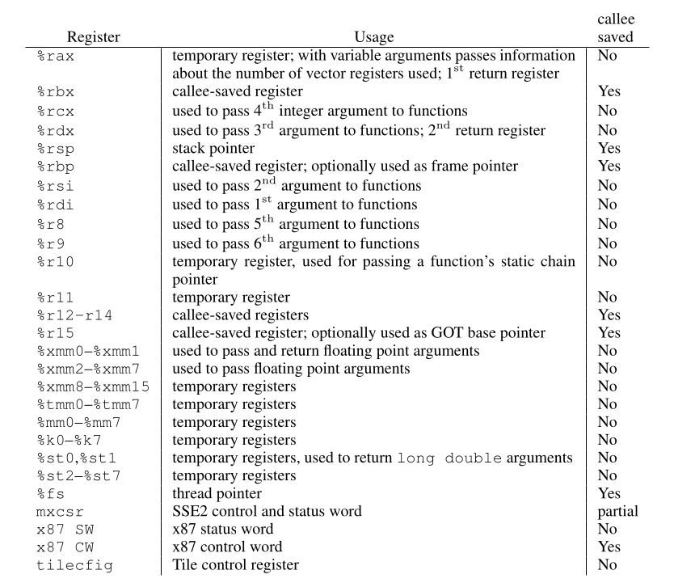
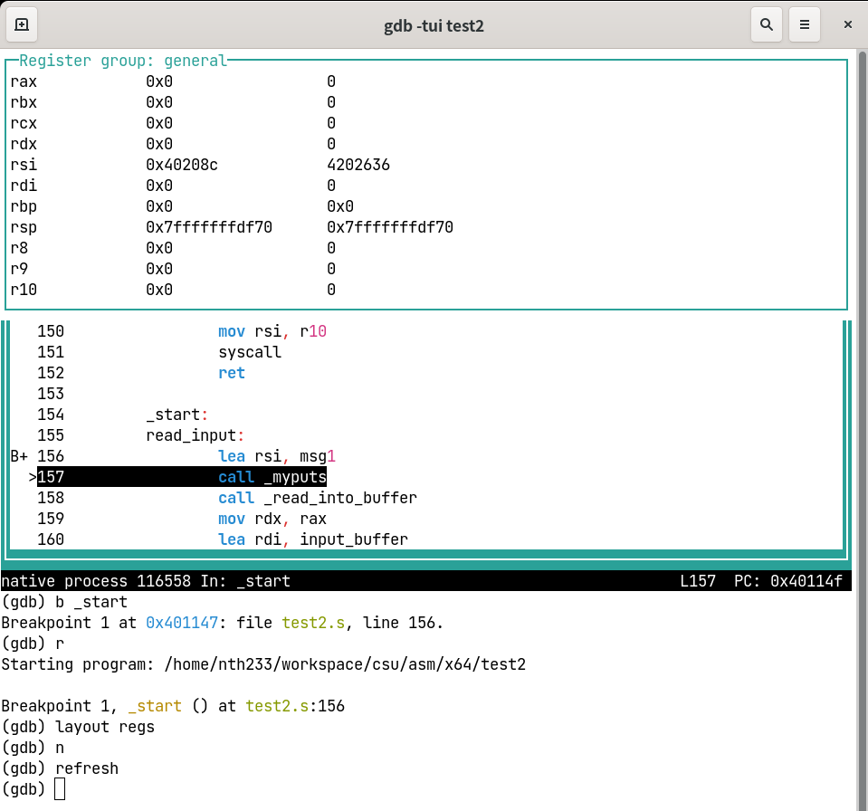

相信所有学习过「计算机组成原理与汇编语言」课程的人都受过8086的折磨：少得可怜的寄存器、远古开发环境、远古命令行调试器`debug`、复古的DOS操作系统，还有一点……**实机不能运行**。如果说前面几点还勉强可以忍受，那么最后一点实在是忍无可忍。8086已经是古玩了，Intel和微软的向前兼容也有限度，这导致了现在流行的64位操作系统上根本无法直接运行为8086编写的代码。于是为了继续教8086，现在国内大量学校使用某部分功能收费的IDE进行教学，写出来的东西也只能在Dosbox里面打转。但是，脱离实机的运行环境，学得再多也难对实践有太多助益。

好在从8086转到x64不困难。基础的指令基本相同，寄存器的名字也一脉相承，而且还干掉了分段和8086奇葩的20根地址线，使得编写程序更简单了（相当于以前的`flat`格式。而且转到x64还能带来生态上的改进：更先进易用的操作系统和更与时俱进的调试器，效率得以大幅提升。

> 之所以给新手教8086的指令集，一般都说是因为「8086简单」。然而和它的兄弟8088相比，8086还复杂了一些，和RISC架构的几个指令集相比，8086更是一点也不简单，甚至和x64相比，8086也只是显得简陋，基础的指令集并不显得更“简单”。并且在当下，8086已经严重过时，使得学习难度变得更高。
>
> 过去给新手教8086，或许只是因为这个架构具有里程碑意义，而且在容易找到可以运行的实机（得益于Intel和微软的垄断地位）。现在给新手教8086，也许只是因为懒于改革而已。实际上应该新手适合学x64（有实机）或者RISC-V（简单）。

## 第一步：寄存器和指令

### 寄存器

在基础的指令集上，实际上没有什么改变的；寄存器也只是改了个名、加了些新的。首先，在`ax`、`bx`、`cx`、`dx`、`si`、`di`这几个8086的通用寄存器前面加上`r`，就得到相应的64位寄存器，比如`rax`、`rdi`。原先的名字依然可以使用，不过得到的是这几个通用寄存器的低16位。把`r`换成`e`，就得到64位寄存器的低32位，比如`eax`，这是i386的遗产。`ah`、`al`这几个8位寄存器仍然可以使用，含义和以前相同。`flags`现在叫做`rflags`，它也是64位宽，不过高32位尚未使用，低32位和32位的`eflags`相同，低16位和之前的`flags`相同。

另外，x64引入了`r8`到`r15`8个新通用寄存器，都是64位宽。后面加上`d`表示取其低32位，加上`w`代表取其低16位，加上`b`代表取其低8位（在intel格式中用`l`）。注意，不存在`r8h`这个寄存器，传统的高8位寄存器`ah`、`bh`、`ch`、`dh`不能和`r8b`这些寄存器同时出现在一条指令里。

> `d`代表双字（doubleword，32位），`w`代表字（word，16位），`b`代表字节（byte）。后面还会提到`q`，代表肆字（quadword，64位）。「肆字」这个叫法是我自己编的，译法参照化学中的「碳碳叁键」。

`ip`现在叫做`rip`。

你会发现我没有提到`ds`、`cs`等段寄存器，没错，他们被干掉了。长模式下段寄存器无用。

此外还有80位宽的浮点数寄存器`fpr0`到`fpr7`，他们的低64位用于MMX寄存器，更具体的内容这里不赘述，因为编写简单的程序似乎不怎么会用到，具体可以查看Intel或AMD的文档。

### 指令

指令实际上没有什么不同。原先的指令被全数保留，即使有细微的差别，通过查文档也可以解决。

所有的指令后面加上`q`、`d`、`w`、`b`可以指明后面操作数的宽度。不过一般不需要手动加，汇编器会自动做。比如下面两条指令其实没有什么差别。

```
addq rax, 100
add rax, 100
```

乘法指令和除法指令也和以前几乎一样。

```
mul bx
mul rbx
```

第一条指令会把`ax`乘`bx`结果的高位存在`dx`中，低位存在`ax`中；类似地，第二条指令会把`rax`乘`rbx`的结果存在`rdx`:`rax`中。

另外还有一点值得注意，寻址的时候应该使用64位寄存器。比如

```
mov ax, word ptr [rsp + 8]
```

把`rsp`换成`sp`则是不对的。

## 第二步：操作系统和汇编器

由于笔者使用Linux，因此下面的内容只针对Linux操作系统。实际上Windows下也只是换汤不换药，改成Windows的系统调用即可。

汇编器我选择了GAS（GNU Assembler），很多发行装好就自带binutils了，其中就包括了GAS。使用命令`as`就可以调用GAS。链接器自然也使用binutils的`ld`。GAS默认使用AT&T的汇编格式，立即数前加`$`，寄存器名字前加`%`，源操作数在前，目标操作数在后。不过我实在难以习惯，还是使用intel的格式。

### 调用约定

Linux继承了System V的调用约定（calling conventions），`rdi`存放第一个参数，`rsi`存放第二个参数，`rdx`存放第三个参数，`r10`存放第四个参数，`r8`存放第五个参数，`r9`存放第六参数。第一个返回值存在`rax`中，第二个返回值存在`rdx`中。按照约定，被调用者保证调用后`rbx`、`r12`到`r15`、`rbp`和`rsp` 内容不变。

详见下图



### 系统调用

系统调用除了要按照上面的调用约定进行调用外，还需要往`rax`中放入系统调用号。下面的最常用的两个系统调用：

| `rax` | System Call | `rdi`           | `rsi`           | `rdx`        |
| ----- | ----------- | --------------- | --------------- | ------------ |
| 0     | sys_read    | unsigned int fd | char *buf       | size_t count |
| 1     | sys_write   | unsigned int fd | const char *buf | size_t count |
| 60    | sys_exit    | int error_code  |                 |              |

`read`和`write`返回值都是实际读/写的字节数。`exit`结束程序，可以设定程序退出后返回的错误码，`0`表示正常。

准备好相关参数，就可以使用`syscall`指令直接进行系统调用。比如下面的代码，把`rsi`指向的内容输出到标准输出中。（UNIX中一切皆文件，`stdin`的文件描述符为0，`stdout`为1，`stderr`为2）

```
lea rsi, msg # msg为要输出的字符串的标号
mov rdi, 1
mov rax, 1
mov rdx, 5 # 输出五个字符
syscall # 系统调用
```

如果`msg`的位置指向字符串`helloworld\0`，那么调用后将输出`hello`。

类似地，下面的代码用于终止程序

```
mov rax, 60
mov rdi, 0
syscall
```

相当于DOS下8086的

```
mov ax, 4c00h
int 21h
```

### GAS代码格式

MASM中里面需要用`xxx segment`和`xxx ends`来定义各种段，GAS中不需要。

`.data`后面的内容就是数据段的内容，`.text`后的内容就是代码段的内容。程序的入口为`_start`，为了让汇编器找到`_start`，需要将其设为外部文件可见的，使用`.global _start`即可。`#`之后的内容为单行注释。

于是一个典型的程序框架如下：

```
.intel_syntax noprefix # 启用intel格式
.data
# 数据段中的一些定义

.text
.global _start

_start:
    # 一些代码
    
    # 终止程序
    mov rax, 60
    mov rdi, 0
    syscall
end
# end 之后的东西会被汇编器忽略
```

GAS中有一些常用的宏。

|                    | 作用                                  |
| ------------------ | ------------------------------------- |
| `.ascii`           | 后跟字符串                            |
| `.asciz`           | 后跟字符串，自动以0结尾               |
| `.byte`            | 后跟一个字节                          |
| `.rept x`和`.endr` | 把`.rept`和`.endr`之间的内容重复`x`遍 |

本文只是概述，更多内容可以参考GAS的文档。

至此，我们可以开始写第一个程序了。

## 第三步：Hello World!

这里直接给出程序。

```
.intel_syntax noprefix
.data
msg: .ascii "Hello World!\n"
.equ msg_len, .-msg

.text
.global _start
_start:
    lea rsi, msg
    mov rdi, 1
    mov rax, 1
    mov rdx, msg_len
    syscall

    mov rax, 60
    mov rdi, 0
    syscall
.end

```

第四行的`.equ msglen, .-msg`定义了一个新符号`msglen`，`.-msg`代表当前地址减去`msg`的偏移量，即为字符串的长度。

编写完成后命名为`helloworld.s`，然后调用下面的命令进行汇编。`-g`是为了便生成调试信息，可以去掉。

```
as -g helloworld.s -o helloworld.o
```

然后链接。

```
ld helloworld.o -o helloworld
```

此时应该会得到一个可执行文件`helloworld`，执行之，即可获得预期的结果：终端输出了`Hello World!`。

只写个Helloworld略有一点乏味，下面的程序读取用户输入的数字，转成二进制输出，把`0`输出为绿色。其中使用了颜色代码`\033[0;32m`（绿色）和`\033[0m`（默认颜色）。绿色代码后的字符全部显示为绿色，默认颜色同理。

```
.intel_syntax noprefix
.data
input_buffer:
.rept 40 
	.byte 0 
.endr
output_buffer:
.rept 100
	.byte 0
.endr
msg1: .asciz "input a num (hex): "
msg2: .asciz "binary: "
color_start: .asciz "\033[0;32m"
color_reset: .asciz "\033[0m"
lf: .ascii "\n"


.text
.global _start

# output LF
_newline:
	mov rax, 1
	mov rdi, 2
	lea rsi, lf
	mov rdx, 1
	syscall
	ret
	
# rdi - string to insert
# rsi - buffer begin
# rdx - pos
_insert_into_buffer:
	xor rax, rax
insert_into_buffer_loop:
	mov al, byte ptr [rdi]
	inc rdi
	cmp al, 0
	jz insert_into_buffer_loop_end
	mov byte ptr [rsi+rdx], al
	inc rdx
	jmp insert_into_buffer_loop
insert_into_buffer_loop_end:
	ret
	
# output rbx in binary
_output_bin:
	push r12
    xor rcx, rcx
output_bin_loop:

	inc rcx
	mov r10, rbx
	and r10, 1
	add r10B, '0'
	push r10
	sar rbx, 1
	cmp rbx, 0
	jnz output_bin_loop

	xor rdx, rdx
output_bin_loop2:
	pop rax
	mov byte ptr [rdx+output_buffer], al
	cmp al, '1'
	jz output_bin_loop2_even
	mov r12b, byte ptr [rdx+output_buffer]
	lea rdi, color_start
	lea rsi, output_buffer
	call _insert_into_buffer

	mov byte ptr [rdx+output_buffer], r12b
	inc rdx

	lea rdi, color_reset
	lea rsi, output_buffer
	call _insert_into_buffer
	jmp output_bin_loop2_odd
output_bin_loop2_even:
	inc rdx
output_bin_loop2_odd:
	loop output_bin_loop2
	
	lea rsi, output_buffer
	mov rax, 1
	mov rdi, 1
	syscall

	pop r12
	ret

# read line into input buffer
_read_into_buffer:
	push r12
	lea rsi, input_buffer
read_into_buffer_loop:
	mov rax, 0
	mov rdx, 1
	syscall
	mov r12b, byte ptr [rsi]
	inc rsi
	cmp r12b, '\n'
	jnz read_into_buffer_loop
	
	mov byte ptr [rsi], 0
	mov rax, rsi
	sub rax, offset input_buffer
	dec rax
	pop r12
	ret

# parse input buffer, write result into rax
# rdi - start of string
# rdx - length
_parse_input:
	mov rcx, rdx
	xor rbx, rbx
	xor rax, rax
parse_input_loop:
	mov bl, byte ptr [rdi]
	cmp bl, 'A'
	jge parse_input_le
	# less then 10
	sub bl, '0'
	jmp parse_input_le_end
parse_input_le:
	sub bl, 'A'
	add bl, 10
parse_input_le_end:
	shl rax, 4
	add rax, rbx
	inc rdi
	loop parse_input_loop
	ret

# calc length, and print the string in rsi
_myputs:
	mov r10, rsi
	xor rdx, rdx
myputs_loop:
	mov bl, byte ptr [rsi]
	cmp bl, 0
	jz myputs_loop_end
	inc rdx
	inc rsi
	jmp myputs_loop
myputs_loop_end:
	mov rax, 1
	mov rdi, 1
	mov rsi, r10
	syscall
	ret
	
_start:
read_input:
	lea rsi, msg1
	call _myputs
	call _read_into_buffer
	mov rdx, rax
	lea rdi, input_buffer
	call _parse_input
	push rax
	
output_in_bin:
	lea rsi, msg2
	call _myputs
	pop rbx
	call _output_bin
	call _newline

	# exit
	mov rax, 60
	mov rdi, 0
	syscall
.end

```

应有以下运行结果


## 第四步：用`gdb`调试

GDB（GNU Debugger）对应MASM的debug，由于提供了TUI界面，要比DOS下的debug好用不知道多少倍。

```
gdb -tui xxx
```

如是即可使用gdb的TUI界面。具体用法已经超出了本文的范畴，网上资料也不少，暂时先不填坑。这里就放一张图。



## 参考

1. [x64介绍](https://software.intel.com/content/www/us/en/develop/articles/introduction-to-x64-assembly.html)
2. [System V ABI](https://gitlab.com/x86-psABIs/x86-64-ABI)
3. [微软的调用约定](https://docs.microsoft.com/en-us/cpp/build/x64-calling-convention?view=msvc-160)
4. [GAS的文档](http://web.mit.edu/gnu/doc/html/as_7.html)
5. [Linux系统调用号表](https://github.com/torvalds/linux/blob/master/arch/x86/entry/syscalls/syscall_64.tbl)
6. [一份整理好的Linux系统调用表](http://blog.rchapman.org/posts/Linux_System_Call_Table_for_x86_64/)
7. [Intel的文档](www.intel.com/content/www/us/en/processors/architectures-software-developer-manuals.html)
8. [关于x86汇编的Wikibook](https://en.wikibooks.org/wiki/X86_Assembly)，建议阅读

